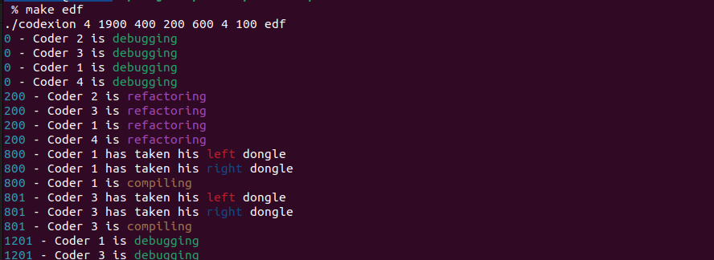
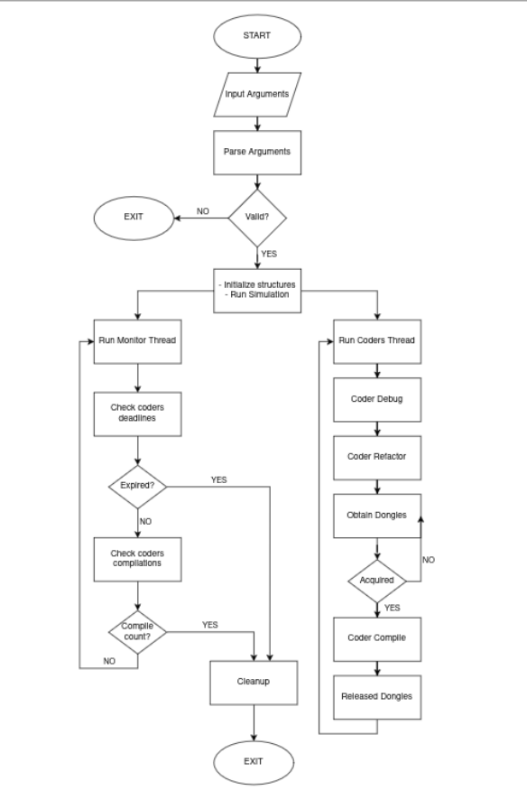

*This project has been created as part of the 42 curriculum by kmalfois*

-------------------------------------------------------------------------------
CODEXION Project
=============

-------------------------------------------------------------------------------
# DESCRIPTION
CODEXION teaches us about the concept of **threads**, **multithreading** and **execution priority**. \
The goal of this project is to run a set number of threads, executing a cycling routine script composed of different timed tasks, that must take in consideration the state of other threads in the program. \
\
To do so, a revised version of the "*Dining Philosophers*" concept will be used in this exercise. \
Here, **coders** (or threads in our project) will need to **debug**, **refactor** and **compile** their code instead.
Just like philosophers need 2 forks to be able to eat, coders will need to acquire 2 USB dongles to have access to the compiling terminal. The difference with the initial concept being that dongles also have a cooling down timer, making them unusable for a set amount of time after a coder's compilation. \
The final goal is for every thread in the program to be able to compile a set amount of times. If a coder can't make a compilation in time, just like philosophers can die from starvation, *coders will be considered burnt out* and the program will shutdown.

-------------------------------------------------------------------------------
# INSTRUCTIONS
The CODEXION program must work with 8 **mandatory** arguments:
- **number_of_coders**: Amount of coders in the circle, and thus the amount of dongles present between each.
- **time_to_burnout**: Time (milliseconds) before a coder's burnout.
- **time_to_compile**: Time (milliseconds) needed by a coder to compile his code.
- **time_to_debug**: Time (milliseconds) needed by a coder to debug his code.
- **time_to_refactor**: Time (milliseconds) needed by a coder to refactor his code.
- **number_of_compiles_required**: Amount of compilations needed per coders for the program to be complete.
- **dongle_cooldown**: Time (milliseconds) for a USB dongle to cooldown and be usable again.
- **scheduler**: Can be set to "fifo" (First In First Out) or "edf" (End of Deadline First).
```shell
#Example
./codexion 4 1900 400 200 600 4 100 edf
```

Threads must then display their respective operations while sharing resources until the program is terminated, rather by coder burnout or compilation quota completed for every coders:



-------------------------------------------------------------------------------
# RESOURCES
GeekForGeeks: [Thread Management Functions in C](https://www.geeksforgeeks.org/c/thread-functions-in-c-c/) \
CodeVault: [Short introduction to threads (pthreads)](https://www.youtube.com/watch?v=d9s_d28yJq0) \
YouTube : [DINING-PHILOSOPHERS PROBLEM: SIMPLIFIED](https://www.youtube.com/watch?v=VSkvwzqo-Pk)


**AI** has been used for clues, information and code assessment.\
**NO CODE IN THIS PROJECT WAS COPY/PASTED FROM AI MODELS !**

-------------------------------------------------------------------------------
# MAKEFILE

Implemented makefile will possess the following commands:
- **make all**: will run the codexion command
- **make codexion** [$(NAME)]: Compiles the program to create the *codexion* binary.
- **make clean**: Destroys the obj folder, containing .o objects.
- **make fclean**: Executes clean command and destroys the codexion binary executable.
- **make re**: Executes fclean followed by codexion to recompile the program.
- **make fifo**: Executes the program with preset arguments to demonstrate a failing fifo scenario.
- **make edf**: Executes the program with the same preset arguments as "*make fifo*" to demonstrate how the edf schedule model manages priority differently.
- **make val**: Executes the "*make edf*" with valgrind to monitor leaks.
- **make lint**: Executes Norminette.

-------------------------------------------------------------------------------
# PROGRAM
## LIBRARIES
This Codexion program implements and uses all authorized libraries in the subject
```c
// LIBRARIES
# include <stdio.h>     // printf, fprintf
# include <unistd.h>    // write, usleep
# include <stdlib.h>    // malloc, free, atoi
# include <string.h>    // strcmp, strlen, memset
# include <pthread.h>   // pthread functions
# include <sys/time.h>  // gettimeofday
```
## ENUMS
Coder state enums
```c
typedef enum e_state
{
   REQ, // Requesting compilation
   COMP, // Compiling
   WORK // Working on debug or refactor
}   t_state;
```
Scheduler enums
```c
typedef enum e_scheduler
{
   EDF, //edf mode
   FIFO //fifo mode
}   t_scheduler;
```
Sim_print function enums
```c
typedef enum e_print
{
   STND, // Standard printf
   CRIT // Critical printf
}   t_print;
```
## STRUCTURES
S_Config regroups all variables required for the execution of the program
```c
typedef struct s_config
{
  int             nbr_coders;
  int             tt_burnout;
  int             tt_compile;
  int             tt_debug;
  int             tt_refactor;
  int             compiles_req;
  int             dgl_cd;
  int             fifo_edf; // 0:fifo 1:edf
  long            time_start; // timestamp of the simulation's start
  int             sim_status; // boolean for the simulation's status
  pthread_mutex_t lock_sim_status; // mutex for consulting sim_status
  pthread_mutex_t lock_write; // mutex to be allowed to write
  pthread_cond_t  cond_room; // monitor wake up call for coders
  pthread_mutex_t	lock_room; // cond_room protection mutex
  pthread_t       monitor; // monitor thread
  t_dongle        *dongles; // dongles array
  t_coder         *coders; // coders array
  t_coder          **prio_map; // coder pointers for ordered priority
}   t_config;
```
S_Coder contains the elements of a coder, including the thread that will be executed.
```c
typedef struct s_coder
{ 
  pthread_t       thread;
  int             id; // ID
  t_state         state; // Coder's state
  long            req_time; // timestamp of the last compile request
  pthread_mutex_t lock_state; // request_time mutex
  int             compiled; // amount of compilations done
  pthread_mutex_t lock_compiled; // compiled mutex
  long            last_comp; // timestamp of the last compilation
  pthread_mutex_t lock_last_comp; // last_comp mutex
  t_config        *config; // pointer to associated s_config to retrieve data
  t_dongle        *l_dgl; // pointer to left USB dongle (N)
  t_dongle        *r_dgl; // pointer to right USB dongle (N+1)
}   t_coder;
```
S_Dongle represents a USB dongle.
```c
typedef struct s_dongle
{
  pthread_mutex_t   dongle; // mutex that reprents the device
  int               id; // ID
  int               in_use; // Allow monitor to quickly check dongle condition
  long              last_released; // last used timestamp
}   t_dongle;
```

## THREADS AND MUTEXES
Threads in C are managed by the ***pthread*** library. \
It supervises the creation and execution of threads and manages the declaration of variables allowing thread entities to communicate with eachothers, ensuring their cohesion.

### pthread_create()
Threads are created using the *pthread_create()* function. \
Once created, the thread will execute their assigned script until an error occurs or the objective is fulfilled.
```c
pthread_create(
  &config->monitor, // Address to thread's allocated memory
  NULL,
  (void *)monitor_script, // Script function that'll be run by the thread
  config // Data passed to the script function
)
```
### pthread_join()
To terminate a thread, we use the *pthread_join()* function
```c
pthread_join(config->monitor, NULL);
```
### pthread_mutex_init()
Threads can communicate using **Mutual Execution** variables.
By locking and unlocking these variables, we ensure that threads do not step on each other during execution. \
```c
pthread_mutex_init(&config->lock_sim_status, NULL);
```
### pthread_mutex_un/lock()
As an example, we cannot let threads use printf() at will, or info displayed in the terminal will be unreadable. \
To solve this issue, we use a function that **locks** the **lock_write mutex** from s_config to "protect" the use of printf. \
If the mutex is locked by another thread, it will wait until a lock is possible before proceeding.
```c
pthread_mutex_lock(&self->config->lock_write);
printf("\033[36m%ld\033[0m - Coder %d %s\n", time, self->id, msg);
pthread_mutex_unlock(&self->config->lock_write);
```
### pthread_cond_init()
pthread_cond_t elements allow a script to be paused to sleep. They're initialized like so:
```c
pthread_cond_init(&coder_arr[i].cond_rdy, NULL);
```
### pthread_cond_wait()
The wait function puts a script to sleep, simultaneously unlocking all locked mutexes for other threads to use if needed.
```c
pthread_cond_wait(&self->cond_rdy, &self->lock_state);
```
### pthread_cond_signal()
Signal will trigger a condition variable to wake up, relocking its previously locked mutexes to continue the script's execution.
```c
pthread_cond_signal(&coder->cond_rdy);
```
### pthread_mutex/cond_destroy()
Once the program's task is over, conditions and mutexes must be deleted to free their allocated memory using *pthread_[...]_destroy()*
```c
pthread_mutex_destroy(&config->coders[i].lock_last_comp);
pthread_cond_destroy(&config->coders[i].cond_rdy);
```

### Blocking cases handled
To prevent a deadlock scenario: coders cannot decide on their own if it is time for compilation. Additionally they're unable to communicate with each other, the monitor is, thus, the only decider in that program.

When the monitor checks if a coder is ready for compilation, it checks if dongles on his sides are available or not through the in_use dongle variable, preventing a deadlock.

For tie-breaking, the monitor will simply give priority to coders that have seniority through the smallest ID.
```c
// From compare_fifo() in monitor_tools.c
if (time0 < time1)
	return (1);
if (time0 == time1 && coder0->id < coder1->id) // in case of tie checks seniority
	return (1);
return (0);
```
```c
// From execution() in monitor.c
int	execute(t_config *config, long long now, int first, int second)
{
	int	result;

	result = 0;
	pthread_mutex_lock(&config->dongles[first].dongle);
	pthread_mutex_lock(&config->dongles[second].dongle);
  // checks if dongles are in_use
	if (!config->dongles[first].in_use && !config->dongles[second].in_use)
	{
    // checks dongles cooldown
		if ((now - config->dongles[first].last_used >= config->dgl_cd) && (now
				- config->dongles[second].last_used >= config->dgl_cd))
			result = 1;
	}
	pthread_mutex_unlock(&config->dongles[second].dongle);
	pthread_mutex_unlock(&config->dongles[first].dongle);
	return (result);
}
```

### Thread synchronization mechanisms
List of mutexes/variables used in this project:
- **(lock_)sim_status**: sim_status can be locked by the monitor to edit the status and signal the end of the simulation.
- **lock_write**: is the mutex to use by coders or the monitor to display a message in the terminal, preventing all parties to try writting at once.
- **(lock_)state & req_time**: registers the timestamp of a coder's last request for compilation and its current status, this will allow the monitor to know a coder's status and evaluate his fifo priority.
- **cond_room**: Condition that allows the monitor to wake coders and let them check if their compilation has been greenlit.
- **lock_room**: Mutex that protects the use of the room's condition.
- **(lock_)compiled**: The amount of compilations done is edited by coders and read by the monitor, this lock is essential to prevent a coder from editing its counter while the monitor is checking all compilation counts.
- **(lock_)last_comp**: is the lock that helps the monitor decide which coder is closest to its deadline for the edf priority.
- **dongle**: is the USB device itself, this mutex will be locked by a coder when in use, then unlocked while updating the last_released variable to manage dongle cooldown.

## CODE INFRASTRUCTURE
- **Makefile**: Command file
- **README.md**: Program guide and information
- **[src]**: Contains all .c files
  - **main.c**: main file
   ```c
   int         main(int argc, char *argv[]); // main function
   static int  start_sim(t_config *config); // starts simulation
   static void end_sim(t_config *config); // ends simulation
   static void report(t_config *config); // optional report
   ```
  - **parser.c**: Checks arguments values
   ```c
   int         parser(int argc, char *argv[]); // parser
   static int  is_valid_number(char *str); // check if positive integers
   static int  is_valid_scheduler(char *str); //check if "fifo" or "edf"
   ```
  - **initializer.c**: Initialize every structures
   ```c
   int             init_config(t_config *config, char *argv[]); // init config struct
   static int      init_arrays(t_config *config); // triggers dongles, coders and prio_map inits
   static t_dongle *init_dongles(int nbr_coders); // init dongles array
   static t_coder  *init_coders(t_config *config, int nbr_coders); // init coders array
   static t_coder  **init_prio_map(t_config *config, int nbr_coders); // init prio_map array
   ```
  - **monitor.c**: monitor script and tools
   ```c
   void        monitor_script(t_config *config); // monitor routine script
   static void sort_map_priority(t_config *config); //sort coders in prio_map
   static void execute_map_priority(t_config *config); //greenlight coders compilation request
   static int  compare(t_coder *coder0, t_coder *coder1, int fifo_edf); // priority check between 2 coders
   static void execution(t_config *config, t_coder *coder, int left, int right); // change coder and associated dongles status
   ```
  - **monitor_tools.c**: coders script's tools
   ```c
   int  check_deadlines(t_config *config); // checks coders deadlines
   int  check_compiles(t_config *config); // checks coders compilation requests time
   int  check_dongles(t_config *config, long long now, int first, int second); // Check if dongles are ready to proceed
   void greenlight_coder(t_config *config, t_coder *coder, int first, int second); // Allows coders to compilate
   ```
  - **coder.c**: coders routine script
   ```c
   void             coder_script(t_coder *self); // Coder's script
   static void      coder_compile(t_coder *self); // Compilation actions
   static t_dongle	*get_first_dgl(t_coder *self); // Get left dongle (relative to ID)
   static t_dongle	*get_second_dgl(t_coder *self); // Get right dongle
   ```
  - **utils.c**: utility functions
   ```c
   long   get_time(void); // returns timestamp in millisecond
   void   sim_print(t_coder *self, char *msg, int critical); // mutex protected print function
   int    check_sim_status(t_config *config); // mutex protected sim status check
   int    compare_fifo(t_coder *coder0, t_coder *coder1); // compares coders with fifo
   int    compare_edf(t_coder *coder0, t_coder *coder1); // compares coders with edf
   ```
- **[include]**
  - **codexion.h**: Contains libraries, structures and non-static function prototypes
- **[obj]**: Contains object files, can be deleted with the *make clean* command
- **[assets]**: Contains images for the README.md

## EXECUTION
Conceptually, a monitor thread will ensure the good execution of the program through a loop, tracking end conditions and supervising coders to make sure they don't step on one another. \
Coder threads do not communicate with each other, they will simply debug, refactor, sleep until awakened by the monitor, then compile to repeat the process anew.

When end conditions are met, whether if it's following a burnout or expected compilation count, the monitor will turn the sim_status variable from s_config to 0, and from here, every thread will cease activity and the routine will be considered finished.

The program will then perform a cleanup, destroying all mutexes and freeing allocated memory, display a report, then shut down.



### FIFO vs EDF
The fifo scheduler will roughly compare time requests to sort its priority.
edf however, will not only sort deadlines, but weigh them, preventing greedy neighbors from hogging dongles for too long.

## CONCLUSION
Playing with threads and understanding their inner workings was very interesting. \
The challenge revolved around the way each thread would access key variables, both for reading, editing or waiting.

The concept of priorities also played an important part of this project, to discern how different scheduling methods dictate the behavior of a multi-thread program was pretty insightful to witness first hand.

As a note, as usual, the true difficulty in C was satisfying the Norminette :p